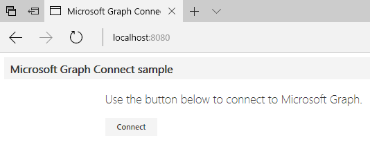
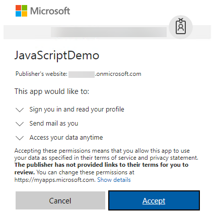
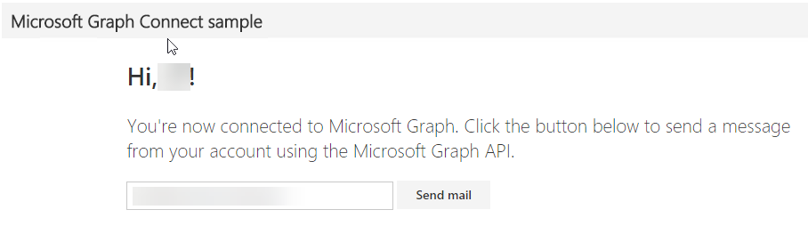

# Build a JavaScript application using Microsoft Graph

There are many sample applications that demonstrate how to use the Microsoft Graph API and the Microsoft Graph SDK available online. This demo will walk you through creating a JavaScript application leveraging the QuickStart project template to quickly get started.

## Register the application

1. Navigate to the [the Azure portal - App registrations](https://go.microsoft.com/fwlink/?linkid=2083908) to register your app. Login using a **personal account** (aka: Microsoft Account) or **Work or School Account**.

1. Select **New registration**. On the **Register an application** page, set the values as follows.
    * Set **Name** to **AngularDemo**. 
    * Set **Supported account types** to **Accounts in any organizational directory and personal Microsoft accounts**.
    * Under **Redirect URI**, set the first drop-down to `Web` and set the value to **http://localhost:8080**

1. Choose **Register**. On the **AngularDemo** page, copy the value of the **Application (client) ID** and save it, you will need it in the next step.

1. Select **Authentication** under **Manage**. Locate the **Implicit grant** section and enable **ID tokens**. Choose **Save**.

1. Select **Certificates & secrets** under **Manage**. Select the **New client secret** button. Enter a value in **Description** and select one of the options for **Expires** and choose **Add**.

1. Copy the **client secret** value before you leave this page. You will need it in the next step.
    > [!IMPORTANT]
    > This client secret is never shown again, so make sure you copy it now.

If you have an existing application that you have registered in the past, feel free to use that instead of creating a new registration.

## Create the application

You will use a QuickStart application to demonstrate working with AngularJS and the Azure AD v2 endpoint.

1. Download/clone the [Microsoft Graph connect sample for AngularJS](https://github.com/microsoftgraph/angular-connect-rest-sample) and open it in a code editor of your choice.
    >Note: This solution requires that you've installed Node.js. Please see the prerequisites in the sample project's [README.md](https://github.com/microsoftgraph/angular-connect-rest-sample/blob/master/README.md) file for more information.

1. Edit the **config.js** file in **[public/scripts](https://github.com/microsoftgraph/angular-connect-rest-sample/tree/master/public/scripts)** and replace the `clientID` placeholder with the placeholder of your application.

1. In a command prompt, change to the **root directory** and run the following:

    ```shell
    npm install
    ```

1. Once installed, start the application by typing:

    ```shell
    npm start
    ```

1. You may receive an error similar to **"npm WARN"** This failure might be due to the use of legacy binary 'node'. To work around this, install the `nodejs-legacy package`.

    ```shell
    sudo apt-get install nodejs-legacy
    ```

1. The command window will show that the application is now listening on **port 8080**. Open a browser and type in **http://localhost:8080**. The application displays a dialog box and prompts you to connect.

    

1. Log in when prompted. Once logged in, grant the permissions requested by the application by selecting **Accept**. The application reads the current user's display name and enables you to send an email.

    

    

1. Inspect the code to see how this was accomplished. The application is hosted as a **Node.js** application that uses **AngularJS**. The `index.html` page defines the **ng-app** element and loads the files in the scripts directory as well as the **mainController.js** file.

    The **graphHelper.js** file contains the code that obtains the token and calls the Microsoft Graph API. An **HTTP GET** is issued to obtain the current user's profile, and an **HTTP POST** is issued to send email on behalf of the current user.

    ```javascript
    // Get the profile of the current user.
    me: function me() {
        return $http.get('https://graph.microsoft.com/v1.0/me');
    },

    // Send an email on behalf of the current user.
    sendMail: function sendMail(email) {
        return $http.post('https://graph.microsoft.com/v1.0/me/sendMail', { 'message' : email, 'saveToSentItems': true });
    }
    ```
