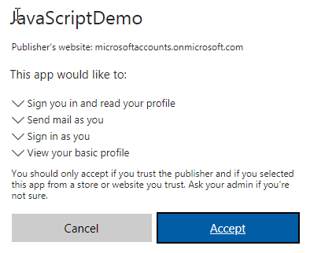

# Build a JavaScript application using Microsoft Graph

There are many sample applications that demonstrate how to use the Microsoft Graph API and the Microsoft Graph SDK available online. This lab will walk you through creating a JavaScript application leveraging the QuickStart project template to quickly get started.

## Register the application

Just like in the previous lab, start by visiting the [Application Registration Portal](https://apps.dev.microsoft.com/) to register the application.


**Copy** the application ID, you'll use this to configure the app.

Under platforms, choose **Add Platform / Web**. Make sure the **Allow Implicit Flow** checkbox is selected, and enter http://localhost:8080 as the redirect URI. Make sure to save changes.


## Create the application

As stated previously, we will use a QuickStart application to demonstrate working with AngularJS and the v2 endpoint. 

**Download/Clone** the [Microsoft Graph Connect Sample for AngularJS](https://github.com/microsoftgraph/angular-connect-rest-sample) and open it in a code editor of your choice. Note this solution requires that you've installed Node.js, please see the prerequisites in the README.md file for more information.

Edit the `config.js` file in public/scripts and replace the **clientID** placeholder with the placeholder of your application.

In a command prompt, change to the **root directory** and run the following:

````shell
npm install
````

Once installed, start the application by typing:

````shell
npm start
````

Note that you may receive an error similar to "npm WARN This failure might be due to the use of legacy binary 'node'. To work around this, install the nodejs-legacy package.

````shell
sudo apt-get install nodejs-legacy
````

The command window will show that the application is now listening on port 8080.  Open a browser and type in the url localhost:8080. The application displays the following dialog box and prompts you to click **Connect**.


You are prompted to log in. Once logged in, you are prompted to grant the permissions requested by the application.



Click **Accept**. The application reads the current user's display name and enables you to send an email.


Inspect the code to see how this was accomplished.

The application is hosted as a Node.js application that uses AngularJS. The `index.html` page defines the ng-app element and loads the files in the scripts directory as well as the `mainController.js` file.

The `graphHelper.js` file contains the code that obtains the token and calls the Graph API. An HTTP GET is issued to obtain the current user's profile, and an HTTP POST is issued to send email on behalf of the current user.

````javascript
// Get the profile of the current user.
me: function me() {
    return $http.get('https://graph.microsoft.com/v1.0/me');
},

// Send an email on behalf of the current user.
sendMail: function sendMail(email) {
    return $http.post('https://graph.microsoft.com/v1.0/me/sendMail', { 'message' : email, 'saveToSentItems': true });
}
````