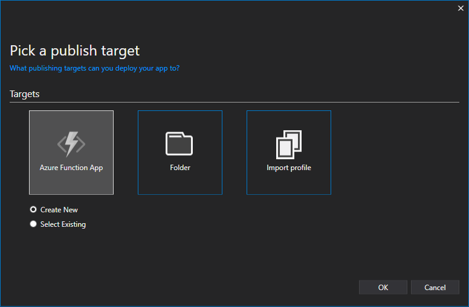
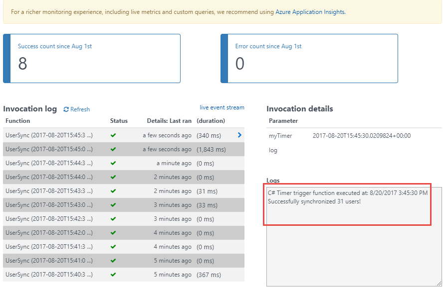

# Build an Azure Function using Microsoft Graph

This demo will build an Azure Function that runs on a scheduled basis to obtain all the users in the directory.

This solution will require an organizational account. An admin is required to provide consent. To facilitate this, you will start with an existing solution. Once you have tested that the app is successfully authenticating and retrieving users, you will implement an Azure Function that synchronizes users.

## Download and configure the starter application

1. Clone or download the following project: [Build a multi-tenant daemon with the Azure AD v2.0 endpoint](https://github.com/Azure-Samples/active-directory-dotnet-daemon-v2)

1. Open the [Application Registration Portal](https://apps.dev.microsoft.com) and register a new application:

1. Copy the **App ID** assigned to your app.

1. Generate an **app secret** of the type **password**, and copy it for later. In production apps you should always use certificates as your app secrets, but for this sample you will use a simple shared secret password.

1. Add the **Web** platform for your app.

1. Enter two **Redirect URIs**:
    - **https://localhost:44316/**
    - **https://localhost:44316/Account/GrantPermissions**

## Configure your app for admin consent

1. In order to use the Azure AD v2.0 admin consent endpoint, you'll need to declare the application permissions your app will use ahead of time. While still in the registration portal, locate the **Microsoft Graph Permissions** section on your app registration. Under **Application Permissions**, add the **User.Read.All** permission. Be sure to save your app registration.

1. After downloading the sample, open it using Visual Studio 2017. Open the **App_Start\Startup.Auth.cs** file, and replace the `clientId` value with the app ID you copied above. Replace the `clientSecret` value with the app secret you copied above.

## Run the sample

1. Start the application called **UserSync**. Sign in as an administrator in your Azure AD tenant. If you don't have an Azure AD tenant for testing, you can [follow these instructions](https://azure.microsoft.com/documentation/articles/active-directory-howto-tenant/) to get one.

1. When the app loads, select the **Get Started** button.

1. On the next page, select **Sign In**. The app will ask you for permission to sign you in & read your user profile. This allows the application to ensure that you are a business user. The application will then try to sync a list of users from your Azure AD tenant via the Microsoft Graph. If it is unable to do so, it asks you (the tenant administrator) to connect your tenant to the application.

1. The application will ask for permission to read the list of users in your tenant. When you grant the permission, the application is able to query for users at any point. You can verify this by selecting the **Sync Users** button on the users page to refresh the list of users. Try adding or removing a user and re-syncing the list but note that it only syncs the first page of users.

    >Note: There is approximately a 20 minute data replication delay between the time when an application is granted admin consent and when the data can successfully synchronize. For more information, read this [issue](https://github.com/Azure-Samples/active-directory-dotnet-daemon-v2/issues/1).

## Create the Azure Function project

Visual Studio 2017 provides new tooling to simplify the creation of Azure Functions while enabling local debugging.

1. Under the **Visual C#/Cloud** node in the tree, choose the **Azure Functions** project template.

    

    >Note: For more details on creating Azure Functions using Visual Studio, see [Azure Functions tools for Visual Studio](https://docs.microsoft.com/en-us/azure/azure-functions/functions-develop-vs).

1. Select **Timer trigger** and change the schedule to the following format:

    ```
    */30 * * * * *
    ```

    

1. In the **NuGet Package Manager Console**, run the following command to install the required packages.

    ```powershell
    Install-Package "Microsoft.Graph"
    Install-Package "Microsoft.Identity.Client" -Version 1.1.4-preview0002
    ```

1. Edit the **local.settings.json** file and add the following items to use while debugging locally.
    - `clientId`: The app ID of the registered application with AAD
    - `clientSecret`: The secret key of the registered application with AAD
    - `tenantId`: The tenant ID of the AAD directory.  You can retrieve this value from your [Microsoft Azure portal](https://portal.azure.com). Select **?** and then select **show diagnostics**.
    - `authorityFormat`: https://login.microsoftonline.com/{0}/v2.0
    - `replyUri`: https://localhost:44316/

    >Note: **AzureWebJobsStorage** and **AzureWebJobsDashboard** will already be set with `UserDevelopmentStorage=true` because you chose **Storage Emulator** as the Storage Account during project creation.

    

1. Refer to the following to verify settings:

    ```json
    {
    "IsEncrypted": false,
    "Values": {
        "AzureWebJobsStorage": "UseDevelopmentStorage=true",
        "AzureWebJobsDashboard": "UseDevelopmentStorage=true",
        "clientId": "b6299aea-4b9e-499f-a590-e2e29c6990e5",
        "clientSecret": "gb9p9w9Z9A9V9#9v94929!$",
        "tenantId": "9a9f949f-79b9-469b-b995-b49fe9ad967d",
        "authorityFormat": "https://login.microsoftonline.com/{0}/v2.0",
        "replyUri": "https://localhost:44316",
        "FUNCTIONS_WORKER_RUNTIME":  "dotnet"
    }
    }
    ```

1. Add a class named `MsGraphUser.cs` to the project with the following contents:

    ```csharp
    using System.Collections.Generic;
    using Newtonsoft.Json;

    namespace AzureSyncFunction
    {
        public class MsGraphUser
        {
            [JsonProperty(PropertyName = "@odata.type")]
            public string odataType { get; set; }
            [JsonProperty(PropertyName = "@odata.id")]
            public string odataId { get; set; }
            public List<string> businessPhones { get; set; }
            public string displayName { get; set; }
            public string givenName { get; set; }
            public string jobTitle { get; set; }
            public string mail { get; set; }
            public string mobilePhone { get; set; }
            public string officeLocation { get; set; }
            public string preferredLanguage { get; set; }
            public string surname { get; set; }
            public string userPrincipalName { get; set; }
            public string id { get; set; }
        }

        public class MsGraphUserListResponse
        {
            [JsonProperty(PropertyName = "@odata.context")]
            public string context { get; set; }
            public List<MsGraphUser> value { get; set; }
        }
    }
    ```

1. Replace the contents of the function class with the following:

    ```csharp
    using System;
    using Microsoft.Azure.WebJobs;
    using Microsoft.Azure.WebJobs.Host;
    using System.Collections.Concurrent;
    using System.Collections.Generic;
    using System.Net.Http;
    using System.Net.Http.Headers;
    using Microsoft.Identity.Client;
    using Newtonsoft.Json;
    using Microsoft.Extensions.Configuration;

    namespace AzureSyncFunction
    {
        public static class UserSync
        {
            private static string msGraphScope = "https://graph.microsoft.com/.default";
            private static string msGraphQuery = "https://graph.microsoft.com/v1.0/users";

            private static ConcurrentDictionary<string, List<MsGraphUser>> usersByTenant = new ConcurrentDictionary<string, List<MsGraphUser>>();

            [FunctionName("UserSync")]
            public static void Run([TimerTrigger("0 */5 * * * *")]TimerInfo myTimer, TraceWriter log, ExecutionContext context)
            {
                log.Info($"C# Timer trigger function executed at: {DateTime.Now}");

                try
                {
                    var config = new ConfigurationBuilder()
                        .SetBasePath(context.FunctionAppDirectory)
                        .AddJsonFile("local.settings.json", optional: true, reloadOnChange: true)
                        .AddEnvironmentVariables()
                        .Build();

                    string clientId = config["clientId"]; 
                    string clientSecret = config["clientSecret"]; 
                    string tenantId = config["tenantId"]; 
                    string authorityFormat = config["authorityFormat"]; 
                    string replyUri = config["authorityFormat"]; 

                    ConfidentialClientApplication daemonClient = new ConfidentialClientApplication(clientId,
                        String.Format(authorityFormat, tenantId),
                        replyUri,
                        new ClientCredential(clientSecret),
                        null, new TokenCache());

                    AuthenticationResult authResult = daemonClient.AcquireTokenForClientAsync(new[] { msGraphScope }).GetAwaiter().GetResult();

                    // Query for list of users in the tenant
                    HttpClient client = new HttpClient();
                    HttpRequestMessage request = new HttpRequestMessage(HttpMethod.Get, msGraphQuery);
                    request.Headers.Authorization = new AuthenticationHeaderValue("Bearer", authResult.AccessToken);
                    HttpResponseMessage response = client.SendAsync(request).GetAwaiter().GetResult();

                    // If the token we used was insufficient to make the query, drop the token from the cache.
                    // The Users page of the website will show a message to the user instructing them to grant
                    // permissions to the app (see User/Index.cshtml).
                    if (response.StatusCode == System.Net.HttpStatusCode.Forbidden)
                    {
                        // BUG: Here, we should clear MSAL's app token cache to ensure that on a subsequent call
                        // to SyncController, MSAL does not return the same access token that resulted in this 403.
                        // By clearing the cache, MSAL will be forced to retrieve a new access token from AAD,
                        // which will contain the most up-to-date set of permissions granted to the app. Since MSAL
                        // currently does not provide a way to clear the app token cache, we have commented this line
                        // out. Thankfully, since this app uses the default in-memory app token cache, the app still
                        // works correctly, since the in-memory cache is not persistent across calls to SyncController
                        // anyway. If you build a persistent app token cache for MSAL, you should make sure to clear
                        // it at this point in the code.
                        //
                        //daemonClient.AppTokenCache.Clear(Startup.clientId);
                        log.Error("Unable to issue query: Received " + response.StatusCode + " in Run method");
                    }

                    if (!response.IsSuccessStatusCode)
                    {
                        log.Error("Unable to issue query: Received " + response.StatusCode + " in Run method");
                    }

                    // Record users in the data store (note that this only records the first page of users)
                    string json = response.Content.ReadAsStringAsync().GetAwaiter().GetResult();
                    MsGraphUserListResponse users = JsonConvert.DeserializeObject<MsGraphUserListResponse>(json);
                    usersByTenant[tenantId] = users.value;
                    log.Info("Successfully synchronized " + users.value.Count + " users!");

                }
                catch (Exception oops)
                {
                    log.Error(oops.Message, oops, "AzureSyncFunction.UserSync.Run");
                }
            }
        }
    }
    ```

## Debug the Azure Function project locally

1. Now that the project is coded and settings are configured, run the Azure Function project locally. A command window appears and provides output from the running function.

    >**Note**: you will need the Microsoft Azure Storage Emulator running. You can find it in your start menu. For more information see [Configuring and using the storage emulator with Visual Studio](https://docs.microsoft.com/en-us/azure/vs-azure-tools-storage-emulator-using#initializing-and-running-the-storage-emulator)

    

1. When the timer fires once every 30 seconds, the display will show the successful execution of the Azure Function.

    

## Deploy the Azure Function project to Microsoft Azure

1. Right-click the Azure Function project and choose **Publish** and then choose **Start**.

1. Select the **Azure Function App**. Select **Create New** and select **OK**.

    

1. Choose your **Azure subscription**, a **resource group**, an **app service plan**, and a **storage account** and then select **Create**. The function is published to your Azure subscription.

    

1. The local configuration settings are not published to the Azure Function. Open the **Azure Function** and choose **Application Settings**. Provide the same key and value pairs that you used within your local debug session.

    

1. Select the **Monitor** node to monitor the Azure Function as it runs every 30 seconds. In the **Logs** window, verify that you are successfully synchronizing users.

    

>Note: If your Azure Function will not execute you may need to modify the **Application Setting** FUNCTIONS_EXTENSION_VERSION to beta  