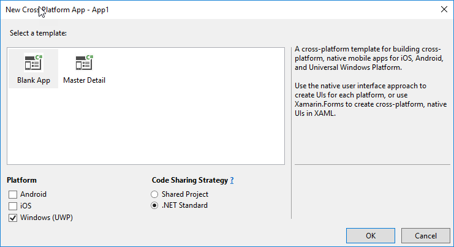

# Create a mobile app with Xamarin using Microsoft Graph

In this demo, you will work through building an application using **Xamarin.Forms**. You must be running Windows 10 for this lab to work. This demo only walks through creating a UWP
application. For more information on creating Android and iOS projects using Xamarin.Forms that target Microsoft Graph API, see the [Xamarin CSharp connect sample on GitHub](https://github.com/microsoftgraph/xamarin-csharp-connect-sample).

## Register the application

1. Visit the [Application Registration Portal](https://apps.dev.microsoft.com/) to register the application.

1. Select the **Add an app** button and enter a name for the application. Select **Create**.

1. Copy the **Application Id** that is generated.

1. In the **Platforms** menu, select **Add Platform**. Add a **Native Application** platform.

1. Under **Microsoft Graph Permissions**, add the **User.Read** delegated permission. Select **Save** to ensure changes are committed.

## Create the application in Visual Studio

1. Open **Visual Studio 2017**. Create a new **Cross-Platform/Mobile App (Xamarin.Forms)** project. 

1. When prompted for the template type, choose **Blank app**.  Unselect iOS and Android from platform and choose **.NET Standard** as the code sharing strategy.

    

1. Two projects were created because you unchecked iOS and Android:
    - `[App]`: a .NET standard class library project where most logic will reside
    - `[App.UWP]`: a Universal Windows Platform project containing Windows display logic

    > Note: This lab only walks through creating a UWP application using Xamarin.Forms. For more information on creating Android and iOS projects using Xamarin.Forms that target Microsoft Graph API, see the [Xamarin CSharp connect sample on GitHub](https://github.com/microsoftgraph/xamarin-csharp-connect-sample).

## Add NuGet packages to projects

1. In **Visual Studio**, go to **Tools > NuGet Package Manager > Package Manager Console**. Install the `Microsoft.Identity.Client` package to all projects, and install the `Newtonsoft.Json` package to the portable class library project. Replace `App1` with the name you gave your solution.

    ```powershell
    Install-Package Microsoft.Identity.Client -ProjectName App1 -Version 1.1.4-preview0002
    Install-Package Newtonsoft.Json -ProjectName App1
    Install-Package Microsoft.Identity.Client -ProjectName App1.UWP -Version 1.1.4-preview0002
    ```

## Edit the .NET standard class library project

1. Edit the **app.xaml.cs** file in the portable class library project. Replace the `using` section with the following:

    ```csharp
    using Microsoft.Identity.Client;
    ```

1. Replace the body of the class with the following:

    ```csharp
    public partial class App : Application
    {
        public static PublicClientApplication PCA = null;
        public static string ClientID = "YOUR_CLIENT_ID";
        public static string[] Scopes = { "User.Read" };
        public static string Username = string.Empty;

        public static UIParent UiParent = null;
        public App()
        {
            InitializeComponent();
            // default redirectURI; each platform specific project will have to override it with its own
            PCA = new PublicClientApplication(ClientID);
            MainPage = new XamarinApp.MainPage();
        }

        protected override void OnStart()
        {
            // Handle when your app starts
        }

        protected override void OnSleep()
        {
            // Handle when your app sleeps
        }

        protected override void OnResume()
        {
            // Handle when your app resumes
        }
    }
    ```

1. Replace the `YOUR_CLIENT_ID` placeholder with the App ID that was generated when the application was registered.

1. Edit the **MainPage.xaml** file. Replace the generated label control with the following:

    ```xml
    <ContentPage.Content>
        <StackLayout>
            <Label Text="MSAL Xamarin Forms Sample" VerticalOptions="Start" HorizontalTextAlignment="Center" HorizontalOptions="FillAndExpand" />
            <BoxView Color="Transparent" VerticalOptions="FillAndExpand" HorizontalOptions="FillAndExpand" />
            <StackLayout x:Name="slUser" IsVisible="False" Padding="5,10">
                <StackLayout Orientation="Horizontal">
                    <Label Text="DisplayName " FontAttributes="Bold" />
                    <Label x:Name="lblDisplayName" />
                </StackLayout>
                <StackLayout Orientation="Horizontal">
                    <Label Text="GivenName " FontAttributes="Bold" />
                    <Label x:Name="lblGivenName" />
                </StackLayout>
                <StackLayout Orientation="Horizontal">
                    <Label Text="Surname " FontAttributes="Bold" />
                    <Label x:Name="lblSurname" />
                </StackLayout>
                <StackLayout Orientation="Horizontal">
                    <Label Text="Id " FontAttributes="Bold" />
                    <Label x:Name="lblId" />
                </StackLayout>
                <StackLayout Orientation="Horizontal">
                    <Label Text="UserPrincipalName " FontAttributes="Bold" />
                    <Label x:Name="lblUserPrincipalName" />
                </StackLayout>
            </StackLayout>
            <BoxView Color="Transparent" VerticalOptions="FillAndExpand" HorizontalOptions="FillAndExpand" />
            <Button x:Name="btnSignInSignOut" Text="Sign in" ed="OnSignInSignOut" VerticalOptions="End" HorizontalOptions="FillAndExpand"/>
        </StackLayout>
    </ContentPage.Content>
    ```

1. Edit the **MainPage.xaml.cs** file. Replace the `using` statements with the following:

    ```csharp
    using Microsoft.Identity.Client;
    using Newtonsoft.Json.Linq;
    using System;
    using System.Linq;
    using System.Net.Http;
    using Xamarin.Forms;
    ```

1. Add the following methods to the `MainPage.xaml.cs` class:

    ```csharp
    protected override async void OnAppearing()
    {
        // let's see if we have a user already
        try
        {
            AuthenticationResult ar =
                await App.PCA.AcquireTokenSilentAsync(App.Scopes, App.PCA.Users.FirstOrDefault());
            RefreshUserData(ar.AccessToken);
            btnSignInSignOut.Text = "Sign out";
        }
        catch
        {
            // doesn't matter, we go in interactive more
            btnSignInSignOut.Text = "Sign in";
        }
    }
    async void OnSignInSignOut(object sender, EventArgs e)
    {
        try
        {
            if (btnSignInSignOut.Text == "Sign in")
            {
                AuthenticationResult ar = await App.PCA.AcquireTokenAsync(App.Scopes, App.UiParent);
                RefreshUserData(ar.AccessToken);
                btnSignInSignOut.Text = "Sign out";
            }
            else
            {
                foreach (var user in App.PCA.Users)
                {
                    App.PCA.Remove(user);
                }
                slUser.IsVisible = false;
                btnSignInSignOut.Text = "Sign in";
            }
        }
        catch (Exception ee)
        {
            await DisplayAlert("Something went wrong signing in/out", ee.Message, "Dismiss");
        }
    }

    public async void RefreshUserData(string token)
    {
        //get data from API
        HttpClient client = new HttpClient();
        HttpRequestMessage message = new HttpRequestMessage(HttpMethod.Get, "https://graph.microsoft.com/v1.0/me");
        message.Headers.Authorization = new System.Net.Http.Headers.AuthenticationHeaderValue("bearer", token);
        HttpResponseMessage response = await client.SendAsync(message);
        string responseString = await response.Content.ReadAsStringAsync();
        if (response.IsSuccessStatusCode)
        {
            JObject user = JObject.Parse(responseString);

            slUser.IsVisible = true;
            lblDisplayName.Text = user["displayName"].ToString();
            lblGivenName.Text = user["givenName"].ToString();
            lblId.Text = user["id"].ToString();
            lblSurname.Text = user["surname"].ToString();
            lblUserPrincipalName.Text = user["userPrincipalName"].ToString();

            // just in case
            btnSignInSignOut.Text = "Sign out";
        }
        else
        {
            await DisplayAlert("Something went wrong with the API call", responseString, "Dismiss");
        }
    }
    ```

## Debug the project

1. To verify the application's behavior, start debugging. In the debug menu, change the platform to x64 (or x86 if your machine isn't 64-bit) and change the target to **Local Machine** and select the **play** button to start debugging.

    

1. When the app loads, select the **Sign In** button at the bottom of the screen. After signing in, the current user's profile information is displayed.

    

>Note: You can sign in using an organizational account such as a work or school account, or you can sign in with a Microsoft account such as a Live.com, Outlook.com, or Hotmail.com personal email address.