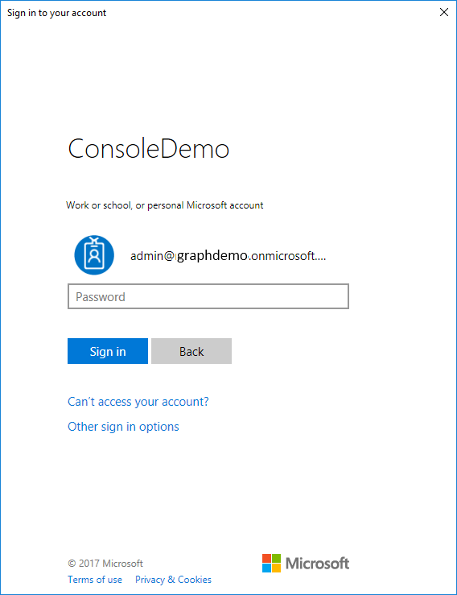
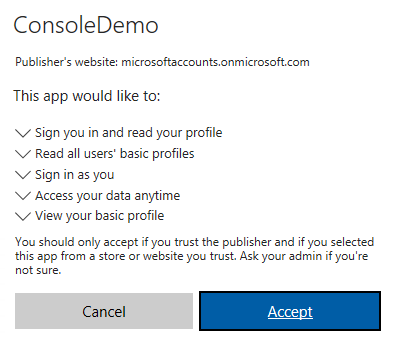
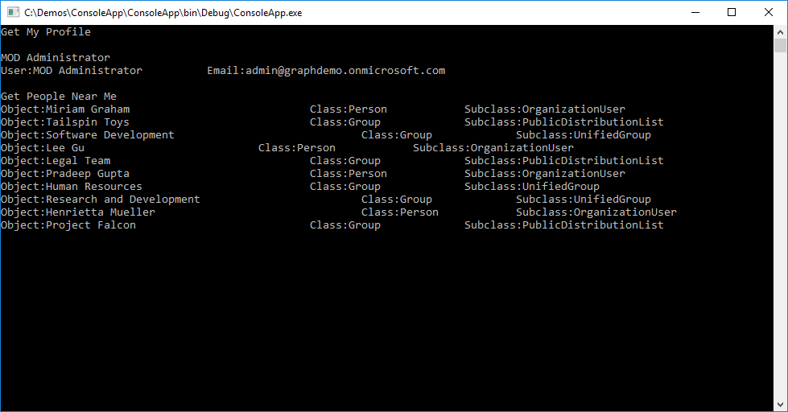
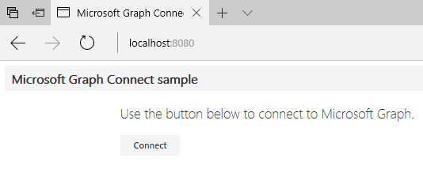
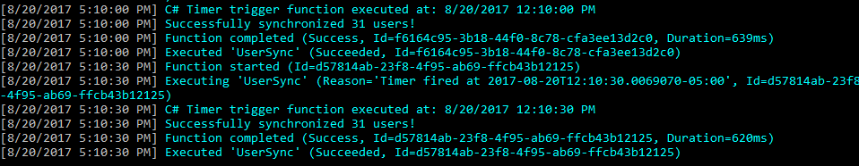
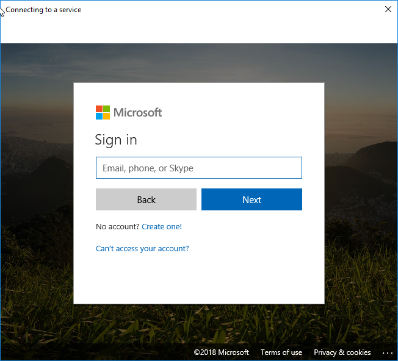

# Lab: Building Microsoft Graph Applications

In this lab, you will walk through building applications that connect with the Microsoft Graph API using multiple technologies.

## In this lab

1. [Build a .NET console application using Microsoft Graph](#exercise-1-build-a-net-console-application-using-microsoft-graph)
1. [Build a JavaScript application using Microsoft Graph](#exercise-2-build-a-javascript-application-using-microsoft-graph)
1. [Build an Azure Function using Microsoft Graph](#exercise-3-build-an-azure-function-using-microsoft-graph)
1. [Build a mobile application with Xamarin using Microsoft Graph](#exercise-4-create-a-mobile-app-with-xamarin-using-microsoft-graph)

## Prerequisites

This lab uses Visual Studio 2017. Exercise 4 requires Windows 10. It also requires an **Azure Active Directory** tenant and a user with administrative privileges.

## Setup

Open the Visual Studio installer and enable the **.NET desktop development**, **Mobile development with .NET**, **Azure development**,and **Universal Windows Platform development** features. Make sure to update Visual Studio 2017 to the latest version, and update VSIX packages (Tools > Extensions and Updates).

## Exercise 1: Build a .NET console application using Microsoft Graph

In this exercise you will create a .NET console application from scratch using .NET Framework 4.7.0, the Microsoft Graph SDK, and the Microsoft Authentication Library (MSAL).

## Register the application 
 
1. Navigate to the [the Azure portal - App registrations](https://go.microsoft.com/fwlink/?linkid=2083908) to register your app. Login using a **personal account** (aka: Microsoft Account) or **Work or School Account**. 
 
1. Select **New registration**. On the **Register an application** page, set the values as follows. 
 
    * Set **Name** to **ConsoleDemo**. 
    * Set **Supported account types** to **Accounts in any organizational directory and personal Microsoft accounts**. 
    * Leave **Redirect URI** empty. 
    * Choose **Register**. 
 
1. On the **ConsoleDemo** page, copy the values of both the **Application (client) ID** and the **Directory (tenant) ID**. Save these two values, since you will need them later. 
 
1. Select the **Add a Redirect URI** link. On the **Redirect URIs** page, locate the **Suggested Redirect URIs for public clients (mobile, desktop)** section. Select the URI that begins with `msal` **and** the **urn:ietf:wg:oauth:2.0:oob** URI. 
 
1. Open the sample solution in Visual Studio and then open the **Constants.cs** file. Change the **Tenant** string to the **Directory (tenant) ID** value you copied earlier. Change the **ClientIdForUserAuthn** string to the **Application (client) ID** value. 

### Create the project in Visual Studio 2017

1. In Visual Studio 2017, create a new **Console Application** project targeting .NET Framework 4.7.2.

    

1. Select **Tools > NuGet Package Manager > Package Manager Console**. In the console window, run the following commands:

    ```powershell
    Install-Package "Microsoft.Graph"
    Install-Package "Microsoft.Identity.Client" -version 1.1.4-preview0002
    Install-Package "System.Configuration.ConfigurationManager"
    ```

1. Edit the **app.config** file, and immediately before the `/configuration` element, add the following element replacing the value with the **Application ID** provided by the Application Registration Portal:

    ```xml
    <appSettings>
        <add key="clientId" value="YOUR CLIENT APPLICATION ID"/>
    </appSettings>
    ```

### Add AuthenticationHelper.cs

1. Add a class to the project named **AuthenticationHelper.cs**. This class will be responsible for authenticating using the Microsoft Authentication Library (MSAL), which is the **Microsoft.Identity.Client** package that we installed.

1. Replace the `using` statement at the top of the file.

    ```csharp
    using Microsoft.Graph;
    using Microsoft.Identity.Client;
    using System;
    using System.Configuration;
    using System.Diagnostics;
    using System.Linq;
    using System.Net.Http.Headers;
    using System.Threading.Tasks;
    ```

1. Replace the `class` declaration with the following:

    ```csharp
    public class AuthenticationHelper
    {
        // The Client ID is used by the application to uniquely identify itself to the v2.0 authentication endpoint.
        static string clientId = ConfigurationManager.AppSettings["clientId"].ToString();
        public static string[] Scopes = { "User.Read" , "People.Read"};

        public static PublicClientApplication IdentityClientApp = new PublicClientApplication(clientId);

        private static GraphServiceClient graphClient = null;

        // Get an access token for the given context and resourceId. An attempt is first made to
        // acquire the token silently. If that fails, then we try to acquire the token by prompting the user.
        public static GraphServiceClient GetAuthenticatedClient()
        {
            if (graphClient == null)
            {
                // Create Microsoft Graph client.
                try
                {
                    graphClient = new GraphServiceClient(
                        "https://graph.microsoft.com/v1.0",
                        new DelegateAuthenticationProvider(
                            async (requestMessage) =>
                            {
                                var token = await GetTokenForUserAsync();
                                requestMessage.Headers.Authorization = new AuthenticationHeaderValue("bearer", token);
                            }));
                    return graphClient;
                }

                catch (Exception ex)
                {
                    Debug.WriteLine("Could not create a graph client: " + ex.Message);
                }
            }

            return graphClient;
        }

        /// <summary>
        /// Get Token for User.
        /// </summary>
        /// <returns>Token for user.</returns>
        public static async Task<string> GetTokenForUserAsync()
        {
            AuthenticationResult authResult = null;
            try
            {
                authResult = await IdentityClientApp.AcquireTokenSilentAsync(Scopes, IdentityClientApp.Users.FirstOrDefault());
                return authResult.AccessToken;
            }
            catch (MsalUiRequiredException ex)
            {
                // A MsalUiRequiredException happened on AcquireTokenSilentAsync.
                //This indicates you need to call AcquireTokenAsync to acquire a token

                authResult = await IdentityClientApp.AcquireTokenAsync(Scopes);

                return authResult.AccessToken;
            }

        }

        /// <summary>
        /// Signs the user out of the service.
        /// </summary>
        public static void SignOut()
        {
            foreach (var user in IdentityClientApp.Users)
            {
                IdentityClientApp.Remove(user);
            }
            graphClient = null;

        }
    }
    ```

### Get the current user's profile using the Microsoft Graph SDK

The Microsoft Graph API makes it easy to obtain the currently logged in user's profile. This sample uses our `AuthenticationHelper.cs` class to obtain an authenticated client before accessing the `/me` endpoint alias.

1. Edit the `Program.cs` class and replace the generated using statements with the following:

    ```csharp
    using Microsoft.Graph;
    using Newtonsoft.Json.Linq;
    using System;
    using System.Diagnostics;
    using System.Net.Http;
    using System.Threading.Tasks;
    ```

1. To get the currently logged in user's profile information, add the following method:

   ```csharp
    /// <summary>
    /// Gets the currently logged in user's profile information
    /// </summary>
    public static async Task<User> GetMeAsync()
    {
        User currentUserObject = null;
        try
        {
            var graphClient = AuthenticationHelper.GetAuthenticatedClient();
            currentUserObject = await graphClient.Me.Request().GetAsync();

            Debug.WriteLine("Got user: " + currentUserObject.DisplayName);
            return currentUserObject;
        }

        catch (ServiceException e)
        {
            Debug.WriteLine("We could not get the current user: " + e.Error.Message);
            return null;
        }
    }
    ```

### Get the users related to the current user using a REST API

The Microsoft Graph API provides REST endpoints to access information and traverse relationships. One such endpoint is the `me/people` endpoint that provides information about people closely related to the current user. The following method demonstrates accessing the underlying `System.Net.HttpClient` to add an access token in the authorization header and to configure the URL for the request.

```csharp

    /// <summary>
    /// Get people near me.  Demonstrates using HttpClient to call the
    /// Graph API.
    /// </summary>
    /// <returns></returns>
    static async Task<string> GetPeopleNearMe()
    {
        try
        {
            //Get the Graph client
            var graphClient = AuthenticationHelper.GetAuthenticatedClient();

            var token = await AuthenticationHelper.GetTokenForUserAsync();

            var request = new HttpRequestMessage(HttpMethod.Get, graphClient.BaseUrl + "/me/people");
            request.Headers.Authorization = new System.Net.Http.Headers.AuthenticationHeaderValue("Bearer", token);

            var response = await graphClient.HttpProvider.SendAsync(request);
            var bodyContents = await response.Content.ReadAsStringAsync();

            Debug.WriteLine(bodyContents);
            return bodyContents;
        }

        catch (Exception e)
        {
            Debug.WriteLine("Could not get people: " + e.Message);
            return null;
        }
    }

```

### Putting it all together

The methods we created use the **async/await** pattern.

1. Create an async method named **RunAsync** with the following implementation:

    ```csharp
    static async Task RunAsync()
    {
        //Display information about the current user
        Console.WriteLine("Get My Profile");
        Console.WriteLine();

        var me = await GetMeAsync();

        Console.WriteLine(me.DisplayName);
        Console.WriteLine("User:{0}\t\tEmail:{1}", me.DisplayName, me.Mail);
        Console.WriteLine();

        //Display information about people near me
        Console.WriteLine("Get People Near Me");

        var peopleJson = await GetPeopleNearMe();
        dynamic people = JObject.Parse(peopleJson);
        if(null != people)
        {
            foreach(var p in people.value)
            {
                var personType = p.personType;
                Console.WriteLine("Object:{0}\t\t\t\tClass:{1}\t\tSubclass:{2}", p.displayName, personType["class"], personType.subclass);
            }
        }
    }
    ```

1. Update the main method to call the `RunAsync()` method.

    ```csharp
    static void Main(string[] args)
    {
        RunAsync().GetAwaiter().GetResult();
        Console.WriteLine("Press any key to close");
        Console.ReadKey();
    }
    ```

1. Run the application and log in when prompted.

    

    >Note: The first time you run it, you will also be prompted to consent to the permissions the application is requesting.

    

1. After the application runs, you will see output similar to the output shown here.

    

## Exercise 2: Build a JavaScript application using Microsoft Graph

There are many sample applications that demonstrate how to use the Microsoft Graph API and the Microsoft Graph SDK available online. This lab will walk you through creating a JavaScript application leveraging the QuickStart project template to quickly get started.

### Register the JavaScript application


1. Navigate to the [the Azure portal - App registrations](https://go.microsoft.com/fwlink/?linkid=2083908) to register your app. Login using a **personal account** (aka: Microsoft Account) or **Work or School Account**. 
 
1. Select **New registration**. On the **Register an application** page, set the values as follows. 
 
* Set **Name** to **AngularDemo**. 
* Set **Supported account types** to **Accounts in any organizational directory and personal Microsoft accounts**. 
* Under **Redirect URI**, set the first drop-down to `Web` and set the value to **http://localhost:8080** 

1. Choose **Register**. On the **AngularDemo** page, copy the value of the **Application (client) ID** and save it, you will need it in the next step.

1. Select **Authentication** under **Manage**. Locate the **Implicit grant** section and enable **ID tokens**. Choose **Save**.

1. Select **Certificates & secrets** under **Manage**. Select the **New client secret** button. Enter a value in **Description** and select one of the options for **Expires** and choose **Add**.

1. Copy the client secret value before you leave this page. You will need it in the next step.
    > [!IMPORTANT]
    > This client secret is never shown again, so make sure you copy it now.

If you have an existing application that you have registered in the past, feel free to use that instead of creating a new registration.

### Create the application

You will use a QuickStart application to demonstrate working with AngularJS and the Azure AD v2 endpoint.

1. Download/clone the [Microsoft Graph connect sample for AngularJS](https://github.com/microsoftgraph/angular-connect-rest-sample) and open it in a code editor of your choice.
    >Note: This solution requires that you've installed Node.js. Please see the prerequisites in the sample project's [README.md](https://github.com/microsoftgraph/angular-connect-rest-sample/blob/master/README.md) file for more information.

1. Edit the **config.js** file in **[public/scripts](https://github.com/microsoftgraph/angular-connect-rest-sample/tree/master/public/scripts)** and replace the `clientID` placeholder with the placeholder of your application.

1. In a command prompt, change to the **root directory** and run the following:

    ```shell
    npm install
    ```

1. Once installed, start the application by typing:

    ```shell
    npm start
    ```

1. You may receive an error similar to **"npm WARN"** This failure might be due to the use of legacy binary 'node'. To work around this, install the `nodejs-legacy package`.

    ```shell
    sudo apt-get install nodejs-legacy
    ```

1. The command window will show that the application is now listening on **port 8080**. Open a browser and type in **http://localhost:8080**. The application displays a dialog box and prompts you to connect.

    

1. Log in when prompted. Once logged in, grant the permissions requested by the application by selecting **Accept**. The application reads the current user's display name and enables you to send an email.

    

    

1. Inspect the code to see how this was accomplished. The application is hosted as a **Node.js** application that uses **AngularJS**. The `index.html` page defines the **ng-app** element and loads the files in the scripts directory as well as the **mainController.js** file.

    The **graphHelper.js** file contains the code that obtains the token and calls the Microsoft Graph API. An **HTTP GET** is issued to obtain the current user's profile, and an **HTTP POST** is issued to send email on behalf of the current user.

    ```javascript
    // Get the profile of the current user.
    me: function me() {
        return $http.get('https://graph.microsoft.com/v1.0/me');
    },

    // Send an email on behalf of the current user.
    sendMail: function sendMail(email) {
        return $http.post('https://graph.microsoft.com/v1.0/me/sendMail', { 'message' : email, 'saveToSentItems': true });
    }
     ```

## Exercise 3: Build an Azure Function using Microsoft Graph

This exercise will build an Azure Function that runs on a scheduled basis to obtain all the users in the directory.

This solution will require an organizational account. An admin is required to provide consent. To facilitate this, you will start with an existing solution. Once you have tested that the app is successfully authenticating and retrieving users, you will implement an Azure Function that synchronizes users.

### Download and configure the starter application

1. Clone or download the following project: [Build a multi-tenant daemon with the Azure AD v2.0 endpoint](https://github.com/Azure-Samples/active-directory-dotnet-daemon-v2)

1. Navigate to the [the Azure portal - App registrations](https://go.microsoft.com/fwlink/?linkid=2083908) to register your app. Login using a **personal account** (aka: Microsoft Account) or **Work or School Account**. 
 
1. Select **New registration**. On the **Register an application** page, set the values as follows. 
 
* Set **Name** to **AzureSyncFunctionDemo**. 
* Set **Supported account types** to **Accounts in any organizational directory and personal Microsoft accounts**. 
* Under **Redirect URI**, set the first drop-down to `Web` and set the value to **https://localhost:44316/**

1. Choose **Register**. On the **AzureSyncFunctionDemo** page, copy the value of the **Application (client) ID** and save it, you will need it in the next step.

1. Select **Authentication** under **Manage**. Locate the **Implicit grant** section and enable **ID tokens**. Choose **Save**.

1. Select **Certificates & secrets** under **Manage**. Select the **New client secret** button. Enter a value in **Description** and select one of the options for **Expires** and choose **Add**.

1. Copy the client secret value before you leave this page. You will need it in the next step.
    > [!IMPORTANT]
    > This client secret is never shown again, so make sure you copy it now.

1. In the list of pages for the app, select **API permissions** 
    - Click the **Add a permission** button and then, 
    - Ensure that the **Microsoft APIs** tab is selected 
    - In the *Commonly used Microsoft APIs* section, click on **Microsoft Graph** 
    - In the **Delegated permissions** section, ensure that the right permissions are checked. Use the search box if necessary.
    - **User.Read.All** 
    - Select the **Add permissions** button 

### Configure your app for admin consent

In order to use the v2.0 admin consent endpoint, you'll need to declare the application permissions your app will use ahead of time.  While still in the registration portal,

- Locate the **API Permissions** section on your app registration.
- Under **Add Permission**, then **Delegated Permissions** select the `User.Read.All` permission.
- Be sure to click on **Add permissions**

### Run the sample

1. Start the application called **UserSync**. Sign in as an administrator in your Azure AD tenant. If you don't have an Azure AD tenant for testing, you can [follow these instructions](https://azure.microsoft.com/documentation/articles/active-directory-howto-tenant/) to get one.

1. When the app loads, select the **Get Started** button.

1. On the next page, select **Sign In**. The app will ask you for permission to sign you in & read your user profile. This allows the application to ensure that you are a business user. The application will then try to sync a list of users from your Azure AD tenant via the Microsoft Graph. If it is unable to do so, it asks you (the tenant administrator) to connect your tenant to the application.

1. The application will ask for permission to read the list of users in your tenant. When you grant the permission, the application is able to query for users at any point. You can verify this by selecting the **Sync Users** button on the users page to refresh the list of users. Try adding or removing a user and re-syncing the list but note that it only syncs the first page of users.

    >Note: There is approximately a 20 minute data replication delay between the time when an application is granted admin consent and when the data can successfully synchronize. For more information, read this [issue](https://github.com/Azure-Samples/active-directory-dotnet-daemon-v2/issues/1).

### Create the Azure Function project

Visual Studio 2017 provides new tooling to simplify the creation of Azure Functions while enabling local debugging.

1. Under the **Visual C#/Cloud** node in the tree, choose the **Azure Functions** project template.

    

    >Note: For more details on creating Azure Functions using Visual Studio, see [Azure Functions tools for Visual Studio](https://docs.microsoft.com/en-us/azure/azure-functions/functions-develop-vs).

1. Select **Timer trigger** and change the schedule to the following format:

    ```text
    */30 * * * * *
    ```

    

1. In the **NuGet Package Manager Console**, run the following command to install the required packages.

    ```powershell
    Install-Package "Microsoft.Graph"
    Install-Package "Microsoft.Identity.Client" -version 1.1.4-preview0002
    ```

1. Edit the **local.settings.json** file and add the following items to use while debugging locally.
    - `clientId`: The app ID of the registered application with AAD
    - `clientSecret`: The secret key of the registered application with AAD
    - `tenantId`: The tenant ID of the AAD directory.  You can retrieve this value from your [Microsoft Azure portal](https://portal.azure.com). Select **?** and then select **show diagnostics**.
    - `authorityFormat`: https://login.microsoftonline.com/{0}/v2.0
    - `replyUri`: https://localhost:44316/

    >Note: **AzureWebJobsStorage** and **AzureWebJobsDashboard** will already be set with `UserDevelopmentStorage=true` because you chose **Storage Emulator** as the Storage Account during project creation.

    

1. Refer to the following to verify settings:

    ```json
    {
    "IsEncrypted": false,
    "Values": {
        "AzureWebJobsStorage": "UseDevelopmentStorage=true",
        "AzureWebJobsDashboard": "UseDevelopmentStorage=true",
        "clientId": "b6299aea-4b9e-499f-a590-e2e29c6990e5",
        "clientSecret": "gb9p9w9Z9A9V9#9v94929!$",
        "tenantId": "9a9f949f-79b9-469b-b995-b49fe9ad967d",
        "authorityFormat": "https://login.microsoftonline.com/{0}/v2.0",
        "replyUri": "https://localhost:44316",
        "FUNCTIONS_WORKER_RUNTIME":  "dotnet"
    }
    }
    ```

1. Add a class named `MsGraphUser.cs` to the project with the following contents:

    ```csharp
    using System.Collections.Generic;
    using Newtonsoft.Json;

    namespace AzureSyncFunction
    {
        public class MsGraphUser
        {
            [JsonProperty(PropertyName = "@odata.type")]
            public string odataType { get; set; }
            [JsonProperty(PropertyName = "@odata.id")]
            public string odataId { get; set; }
            public List<string> businessPhones { get; set; }
            public string displayName { get; set; }
            public string givenName { get; set; }
            public string jobTitle { get; set; }
            public string mail { get; set; }
            public string mobilePhone { get; set; }
            public string officeLocation { get; set; }
            public string preferredLanguage { get; set; }
            public string surname { get; set; }
            public string userPrincipalName { get; set; }
            public string id { get; set; }
        }

        public class MsGraphUserListResponse
        {
            [JsonProperty(PropertyName = "@odata.context")]
            public string context { get; set; }
            public List<MsGraphUser> value { get; set; }
        }
    }
    ```

1. Rename `Function1.cs` to `UserSync.cs` and replace the contents of the function class with the following:

    ```csharp
    using System;
    using Microsoft.Azure.WebJobs;
    using Microsoft.Extensions.Logging;
    using System.Collections.Concurrent;
    using System.Collections.Generic;
    using System.Net.Http;
    using System.Net.Http.Headers;
    using Microsoft.Identity.Client;
    using Newtonsoft.Json;

    namespace AzureSyncFunction
    {
        public static class UserSync
        {
            private static string msGraphScope = "https://graph.microsoft.com/.default";
            private static string msGraphQuery = "https://graph.microsoft.com/v1.0/users";

            private static ConcurrentDictionary<string, List<MsGraphUser>> usersByTenant = new ConcurrentDictionary<string, List<MsGraphUser>>();

            [FunctionName("UserSync")]
            public static void Run([TimerTrigger("*/30 * * * * *")]TimerInfo myTimer, ILogger log, ExecutionContext context)
            {
                log.LogInformation($"C# Timer trigger function executed at: {DateTime.Now}");

                try
                {
                    string clientId = Environment.GetEnvironmentVariable("clientId"); 
                    string clientSecret = Environment.GetEnvironmentVariable("clientSecret"); 
                    string tenantId = Environment.GetEnvironmentVariable("tenantId"); 
                    string authorityFormat = Environment.GetEnvironmentVariable("authorityFormat"); 
                    string replyUri = Environment.GetEnvironmentVariable("authorityFormat");  

                    ConfidentialClientApplication daemonClient = new ConfidentialClientApplication(clientId,
                        String.Format(authorityFormat, tenantId),
                        replyUri,
                        new ClientCredential(clientSecret),
                        null, new TokenCache());

                    AuthenticationResult authResult = daemonClient.AcquireTokenForClientAsync(new[] { msGraphScope }).GetAwaiter().GetResult();

                    // Query for list of users in the tenant
                    HttpClient client = new HttpClient();
                    HttpRequestMessage request = new HttpRequestMessage(HttpMethod.Get, msGraphQuery);
                    request.Headers.Authorization = new AuthenticationHeaderValue("Bearer", authResult.AccessToken);
                    HttpResponseMessage response = client.SendAsync(request).GetAwaiter().GetResult();

                    // If the token we used was insufficient to make the query, drop the token from the cache.
                    // The Users page of the website will show a message to the user instructing them to grant
                    // permissions to the app (see User/Index.cshtml).
                    if (response.StatusCode == System.Net.HttpStatusCode.Forbidden)
                    {
                        // BUG: Here, we should clear MSAL's app token cache to ensure that on a subsequent call
                        // to SyncController, MSAL does not return the same access token that resulted in this 403.
                        // By clearing the cache, MSAL will be forced to retrieve a new access token from AAD,
                        // which will contain the most up-to-date set of permissions granted to the app. Since MSAL
                        // currently does not provide a way to clear the app token cache, we have commented this line
                        // out. Thankfully, since this app uses the default in-memory app token cache, the app still
                        // works correctly, since the in-memory cache is not persistent across calls to SyncController
                        // anyway. If you build a persistent app token cache for MSAL, you should make sure to clear
                        // it at this point in the code.
                        //
                        //daemonClient.AppTokenCache.Clear(Startup.clientId);
                        log.LogError("Unable to issue query: Received " + response.StatusCode + " in Run method");
                    }

                    if (!response.IsSuccessStatusCode)
                    {
                        log.LogError("Unable to issue query: Received " + response.StatusCode + " in Run method");
                    }

                    // Record users in the data store (note that this only records the first page of users)
                    string json = response.Content.ReadAsStringAsync().GetAwaiter().GetResult();
                    MsGraphUserListResponse users = JsonConvert.DeserializeObject<MsGraphUserListResponse>(json);
                    usersByTenant[tenantId] = users.value;
                    log.LogInformation("Successfully synchronized " + users.value.Count + " users!");

                }
                catch (Exception oops)
                {
                    log.LogError(oops.Message, oops, "AzureSyncFunction.UserSync.Run");
                }
            }
        }
    }


    ```

### Debug the Azure Function project locally

1. Now that the project is coded and settings are configured, run the Azure Function project locally. A command window appears and provides output from the running function.

    >**Note**: you will need the Microsoft Azure Storage Emulator running. You can find it in your start menu. For more information see [Configuring and using the storage emulator with Visual Studio](https://docs.microsoft.com/en-us/azure/vs-azure-tools-storage-emulator-using#initializing-and-running-the-storage-emulator)

    

1. When the timer fires once every 30 seconds, the display will show the successful execution of the Azure Function.

    

### Deploy the Azure Function project to Microsoft Azure

1. Right-click the Azure Function project and choose **Publish**.

1. Select the **Azure Function App**. Select **Create New** and select **OK**.

    

1. Choose your **Azure subscription**, a **resource group**, an **app service plan**, and a **storage account** and then select **Create**. The function is published to your Azure subscription.

    

1. The local configuration settings are not published to the Azure Function. Open the **Azure Function** and choose **Application Settings**. Provide the same key and value pairs that you used within your local debug session.

    

1. Select the **Monitor** node to monitor the Azure Function as it runs every 30 seconds. In the **Logs** window, verify that you are successfully synchronizing users.

    

    >Note: If your Azure Function will not execute you may need to modify the **Application Setting** FUNCTIONS_EXTENSION_VERSION to beta  

## Exercise 4: Create a mobile app with Xamarin using Microsoft Graph

In this exercise, you will work through building an application using **Xamarin.Forms**. You must be running Windows 10 for this lab to work. This demo only walks through creating a UWP
application. For more information on creating Android and iOS projects using Xamarin.Forms that target Microsoft Graph API, see the [Xamarin CSharp connect sample on GitHub](https://github.com/microsoftgraph/xamarin-csharp-connect-sample).

### Register the Xamarin application


1. Navigate to the [Azure portal - App registrations](https://go.microsoft.com/fwlink/?linkid=2083908) page. 
1. Select **New registration**. 
1. When the **Register an application page** appears, enter your application's registration information: 
    - In the **Name** section, enter a meaningful application name that will be displayed to users of the app, for example `XamarinApp Sample`. 
    - In the **Supported account types** section, select **Accounts in any organizational directory**. 
1. Select **Register** to create the application. 
1. On the app **Overview** page, find the **Application (client) ID** value and record it for later. You'll need it to configure the Visual Studio configuration file for this project. 
1. In the list of pages for the app, select **Manifest**, and: 
    - In the manifest editor, set the ``allowPublicClient`` property to **true** 
    - Select **Save** in the bar above the manifest editor. 
1. In the list of pages for the app, select **API permissions** 
    - Click the **Add a permission** button and then, 
    - Ensure that the **Microsoft APIs** tab is selected 
    - In the *Commonly used Microsoft APIs* section, click on **Microsoft Graph** 
    - In the **Delegated permissions** section, ensure that the right permissions are checked. Use the search box if necessary.
    - **User.Read** 
    - Select the **Add permissions** button 

### Create the application in Visual Studio

1. Open **Visual Studio 2017**. Create a new **Cross-Platform/Mobile App (Xamarin.Forms)** project. 

1. When prompted for the template type, choose **Blank app**.  Unselect iOS and Android from platform and choose **.NET Standard** as the code sharing strategy.

    

1. Two projects were created because you unchecked iOS and Android:
    - `[App1]`: a .NET standard class library project where most logic will reside
    - `[App1.UWP]`: a Universal Windows Platform project containing Windows display logic

    > Note: This lab only walks through creating a UWP application using Xamarin.Forms. For more information on creating Android and iOS projects using Xamarin.Forms that target Microsoft Graph API, see the [Xamarin CSharp connect sample on GitHub](https://github.com/microsoftgraph/xamarin-csharp-connect-sample).

### Add NuGet packages to projects

1. In **Visual Studio**, go to **Tools > NuGet Package Manager > Package Manager Console**. Install the `Microsoft.Identity.Client` package to all projects, and install the `Newtonsoft.Json` package to the portable class library project. Replace `App1` with the name you gave your solution.

    ```powershell
    Install-Package Microsoft.Identity.Client -ProjectName App1 -version 1.1.4-preview0002
    Install-Package Newtonsoft.Json -ProjectName App1
    Install-Package Microsoft.Identity.Client -ProjectName App1.UWP -version 1.1.4-preview0002
    ```

### Edit the .NET standard class library project

1. Edit the **app.xaml.cs** file in the portable class library project. Replace the `using` section with the following:

    ```csharp
    using Xamarin.Forms;
    using Xamarin.Forms.Xaml;
    using Microsoft.Identity.Client;
    ```

1. Replace the body of the class with the following:

    ```csharp
    public partial class App : Application
    {
        public static PublicClientApplication PCA = null;
        public static string ClientID = "YOUR_CLIENT_ID";
        public static string[] Scopes = { "User.Read" };
        public static string Username = string.Empty;

        public static UIParent UiParent = null;
        public App()
        {
            InitializeComponent();
            // default redirectURI; each platform specific project will have to override it with its own
            PCA = new PublicClientApplication(ClientID);
            MainPage = new XamarinApp.MainPage();
        }

        protected override void OnStart()
        {
            // Handle when your app starts
        }

        protected override void OnSleep()
        {
            // Handle when your app sleeps
        }

        protected override void OnResume()
        {
            // Handle when your app resumes
        }
    }
    ```

1. Replace the `YOUR_CLIENT_ID` placeholder with the App ID that was generated when the application was registered.

1. Edit the **MainPage.xaml** file. Replace the generated `StackLayout` control with the following:

    ```xml
    <StackLayout>
        <Label Text="MSAL Xamarin Forms Sample" VerticalOptions="Start" HorizontalTextAlignment="Center" HorizontalOptions="FillAndExpand" />
        <BoxView Color="Transparent" VerticalOptions="FillAndExpand" HorizontalOptions="FillAndExpand" />
        <StackLayout x:Name="slUser" IsVisible="False" Padding="5,10">
            <StackLayout Orientation="Horizontal">
                <Label Text="DisplayName " FontAttributes="Bold" />
                <Label x:Name="lblDisplayName" />
            </StackLayout>
            <StackLayout Orientation="Horizontal">
                <Label Text="GivenName " FontAttributes="Bold" />
                <Label x:Name="lblGivenName" />
            </StackLayout>
            <StackLayout Orientation="Horizontal">
                <Label Text="Surname " FontAttributes="Bold" />
                <Label x:Name="lblSurname" />
            </StackLayout>
            <StackLayout Orientation="Horizontal">
                <Label Text="Id " FontAttributes="Bold" />
                <Label x:Name="lblId" />
            </StackLayout>
            <StackLayout Orientation="Horizontal">
                <Label Text="UserPrincipalName " FontAttributes="Bold" />
                <Label x:Name="lblUserPrincipalName" />
            </StackLayout>
        </StackLayout>
        <BoxView Color="Transparent" VerticalOptions="FillAndExpand" HorizontalOptions="FillAndExpand" />
        <Button x:Name="btnSignInSignOut" Text="Sign in" Clicked="OnSignInSignOut" VerticalOptions="End" HorizontalOptions="FillAndExpand"/>
    </StackLayout>
    ```

1. Edit the **MainPage.xaml.cs** file. Replace the `using` statements with the following:

    ```csharp
    using System;
    using System.Linq;
    using Xamarin.Forms;
    using Microsoft.Identity.Client;
    using Newtonsoft.Json.Linq;
    using System.Net.Http;
    ```

1. Add the following methods to the `MainPage.xaml.cs` class:

    ```csharp
    protected override async void OnAppearing()
    {
        // let's see if we have a user already
        try
        {
            AuthenticationResult ar =
                await App.PCA.AcquireTokenSilentAsync(App.Scopes, App.PCA.Users.FirstOrDefault());
            RefreshUserData(ar.AccessToken);
            btnSignInSignOut.Text = "Sign out";
        }
        catch
        {
            // doesn't matter, we go in interactive more
            btnSignInSignOut.Text = "Sign in";
        }
    }
    async void OnSignInSignOut(object sender, EventArgs e)
    {
        try
        {
            if (btnSignInSignOut.Text == "Sign in")
            {
                AuthenticationResult ar = await App.PCA.AcquireTokenAsync(App.Scopes, App.UiParent);
                RefreshUserData(ar.AccessToken);
                btnSignInSignOut.Text = "Sign out";
            }
            else
            {
                foreach (var user in App.PCA.Users)
                {
                    App.PCA.Remove(user);
                }
                slUser.IsVisible = false;
                btnSignInSignOut.Text = "Sign in";
            }
        }
        catch (Exception ee)
        {
            await DisplayAlert("Something went wrong signing in/out", ee.Message, "Dismiss");
        }
    }

    public async void RefreshUserData(string token)
    {
        //get data from API
        HttpClient client = new HttpClient();
        HttpRequestMessage message = new HttpRequestMessage(HttpMethod.Get, "https://graph.microsoft.com/v1.0/me");
        message.Headers.Authorization = new System.Net.Http.Headers.AuthenticationHeaderValue("bearer", token);
        HttpResponseMessage response = await client.SendAsync(message);
        string responseString = await response.Content.ReadAsStringAsync();
        if (response.IsSuccessStatusCode)
        {
            JObject user = JObject.Parse(responseString);

            slUser.IsVisible = true;
            lblDisplayName.Text = user["displayName"].ToString();
            lblGivenName.Text = user["givenName"].ToString();
            lblId.Text = user["id"].ToString();
            lblSurname.Text = user["surname"].ToString();
            lblUserPrincipalName.Text = user["userPrincipalName"].ToString();

            // just in case
            btnSignInSignOut.Text = "Sign out";
        }
        else
        {
            await DisplayAlert("Something went wrong with the API call", responseString, "Dismiss");
        }
    }
    ```

### Debug the project

1. To verify the application's behavior, start debugging. In the debug menu, change the platform to x64 (or x86 if your machine isn't 64-bit) and change the target to **Local Machine** and select the **play** button to start debugging.

    

1. When the app loads, select the **Sign In** button at the bottom of the screen. After signing in, the current user's profile information is displayed.

    

>Note: You can sign in using an organizational account such as a work or school account, or you can sign in with a Microsoft account such as a Live.com, Outlook.com, or Hotmail.com personal email address.